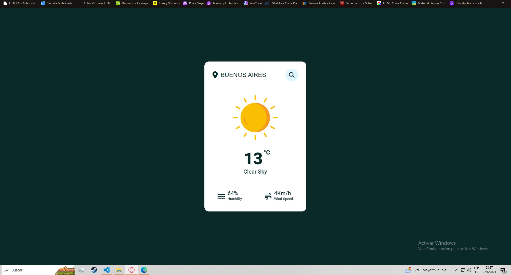
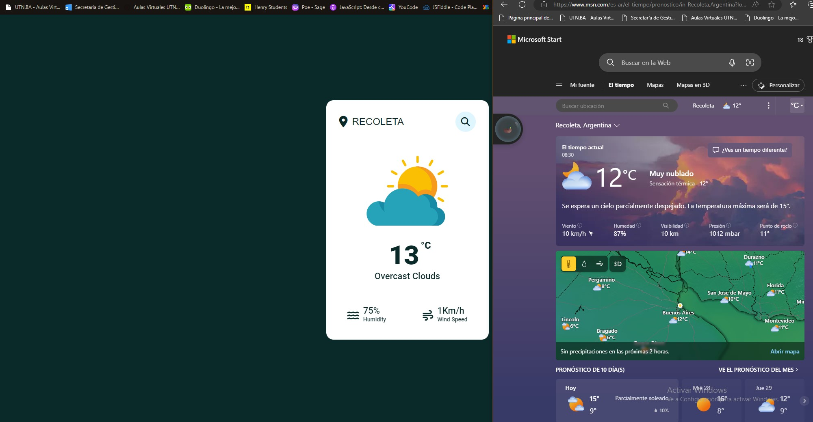

# Weather App
Una aplicación meteorológica que brinda información actualizada sobre las condiciones climáticas, como temperatura, humedad, viento y pronósticos para ayudarte a planificar tu día. Te permite conocer el clima de tu ubicación actual o de cualquier otra ciudad, brindando datos precisos y detallados para que puedas tomar decisiones informadas sobre tus actividades al aire libre.

Realizado con la API de AccuWeather, por lo tanto tiene cierto delay de aproximadamente 30 min y solo presenta datos de la prueba gratuita como: Viento, nubosidad, temperatura, humedad. 

